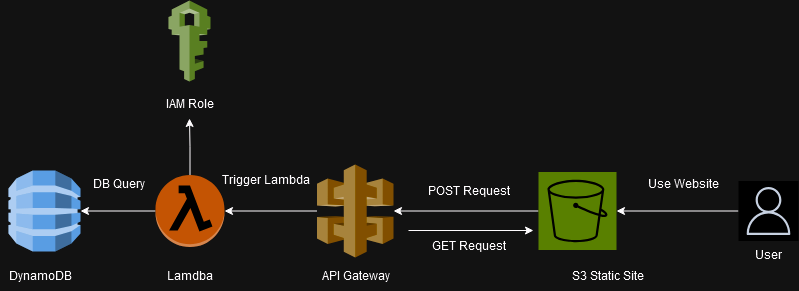
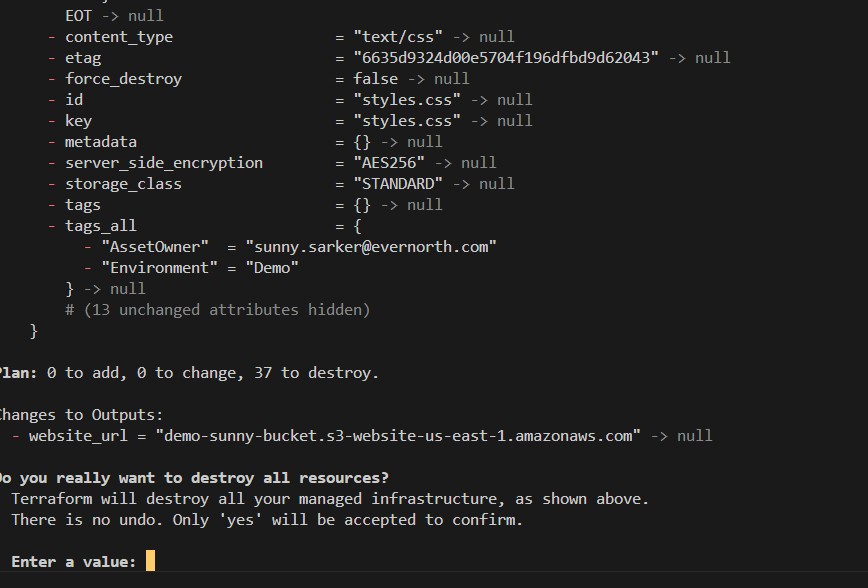

# Introduction to Cloud - IaC Demo

This demo will be aimed for beginners to AWS development to deploy their first serverless application into AWS using terraform.

## Background

### Introduction
We are going to build a basic serverless application in AWS using DynamoDB, Lambda, API gateway, and S3 static site hosting. 

This project is a serverless application designed to manage an email list through a simple and user-friendly webpage. It enables users to add their name and email to a database and retrieve stored entries by searching for an email address. The front-end is a static webpage hosted in an S3 bucket, while the back-end leverages AWS services like API Gateway, Lambda, and DynamoDB. Terraform is used to manage the entire infrastructure as code, ensuring scalability and maintainability.

Users can interact with the application through two main features: adding a new email entry via a form that triggers a POST request, and searching for email entries via a GET request. The application supports Cross-Origin Resource Sharing (CORS), allowing seamless communication between the front-end and back-end. This project highlights how serverless technologies can be combined to create a cost-effective and scalable solution for managing simple data workflows.

The architecture will look like the following:

 

### Resources to Build
This Terraform module creates the following resources:

- A [DynamoDB table](terraform/dynamodb.tf) named `"{project_name}-email-table"`.
- Two [Lambda functions](terraform/lambda.tf) named `"{project_name}-Lambda1"` and `"{project_name}-Lambda2"` that queries the DynamoDB table to read or write. They wil be associated with different API requests for GET and POST
- An [IAM role](terraform/role.tf) for the Lambda function with the necessary permissions to access DynamoDB.
- An [API Gateway REST API](terraform/api_gateway.tf) named `"{project_name}-my-api"` with a resource and method for the "/hello" endpoint.
- An [S3 bucket](terraform/s3.tf) with the correct policies and static site hosting enabled.

## Instructions
### 1. Prerequisites

- Install [Terraform](https://developer.hashicorp.com/terraform/install)
- Have an AWS Account ready to use (personal or A Cloud Guru Sandbox recommended for static site hosting)
  - Install the [AWS CLI](https://docs.aws.amazon.com/cli/latest/userguide/getting-started-install.html)
  - If you have an account ready to use, have used saml2aws before, and have it set up, you can use that instead as well by setting profile in the next step to either `saml` or `default` depending on how you set it up with `saml2aws configure` or `aws configure`

Confrim you have both by running `terraform --version` and `aws --version`

#### **If Using Cigna Account and saml2aws:**

In order to use a cigna account you need the following setps as well:

- Access to an AWS account (if dont have access already)
  - request the needed GG
  - make sure this is at least a DEVELOPER role with write access
  - If you are in  Health Services/ESI, you need to also request a second global group that starts with APP_{gg_name} in Users & Groups for Health Services in Saviynt
    - More information [here](https://confluence.sys.cigna.com/pages/viewpage.action?pageId=332050198)
  - You can verify by opening Okta and searching "AWS" to see if that option pops up. Once it does you can go to the log in screen and find that account and role.
- Setup [saml2aws](https://github.sys.cigna.com/cigna/okta-auto-federation/wiki)
  - Run `saml2aws --help` to verify the install
  - Set the saml2aws profile to default during setup

You will also need to add in t
- Chnage Provider .tf
- Change terraform commands 

### 2. Configuring your AWS profile or saml2aws (cigna account)

#### AWS Configure:
Feel free to ignore this step if you have aws cli or saml2aws set up and have already logged in.

```sh
aws configure --profile my-test-account
```

When prompted pass in the following:

- AWS Access Key ID: Your personal account access key ID.
- AWS Secret Access Key: Your personal account secret access key.
- Default region: Choose the region you want to use (e.g., us-east-1).
- Default output format: Choose json or text, as per your preference.

To verify you can check your `~/.aws/credentials` file in your terminal.

*Note: if using a acloud guru account these accounts will shut down in a few hours so will need to re run this command if needed*

#### saml2aws (cigna account):

##### Step 1: saml2aws configure (if you havent already)
Before running any terraform commands, make sure to run `saml2aws configure` and sign in accordingly. For saml2aws to work with this project, make sure to set profile to `default`.

You can always rerun saml2aws configure to set the profile back to default when necessary, as that is usually needed to use the AWS CLI for other work. 

##### Step 2: saml2aws login
After that, `saml2aws login` and authenticate as needed. This adds the needed aws credentials into your default aws profile for terraform to reference. 

##### Step 3: Setup Backend.tfvars in Config
in `terraform/config` you normally create a folder corresponding to the environment you want to push too (sdbx, dev, test, prod, etc.)

I have this folder created but everything in the file is commented out, simply comment it back in.

In this case, we will create a folder called `sdbx`.

In this folder, create a file called `backend.tfvars` and make that file look like the following:

```terraform
bucket         = "cigna-tf-state-{ACCOUNT_NUMBER_HERE}"
key            = "tecdp-training-2024-test/sdbx.tfstate"
region         = "us-east-1"
dynamodb_table = "cigna-tf-lock-{ACCOUNT_NUMBER_HERE}"
profile        = "default"
```

Every Cigna account has a tfstate bucket corresponding to that account. If we werent using a cigna account we would simply have the tfstate locally in our current directory, but this enables better collaboration and tracking if this is an account for a large team. 

Make sure to replace `{ACCOUNT_NUMBER_HERE}` with your own account number. For this demo I am using a sandbox account so am calling my key as sdbx.tfstate but you can match it with dev or whatever account type prefix you have if you would like but not necessary. 

If you have any environment specific variables, you can also add a variables.tfvars file so that certain variables can only apply to each environment. For example, if you want to keep track of what environment you are in your code, you can set `"environment" = "dev"` and call it with `var.environment` throughout your code. If you want to do this, you also need to call those same varibales in your `_variables.tf` file to be used for the whole module in that folder path. I left the `variables.tfvars` files there but commented out if you would like to try on your own. 

Make sure to also go into the `_providers.tf` file and comment back in backend "s3" {} so that when you run your terraform commands it knows to search in s3. In the same file also set profile to either "default" or "saml" depending how you set up your saml2aws profile. 

### 3. Running terraform
In order to deploy this applicaiton. You need to first go into the terraform directory then run the terraform workflow.

I also recommend going into the terraform folder, opening `locals.tf` and updating the name of the prefix to whatever name you would like.

This is so that each resource name will start with this prefix as it is referenced in each terraform resource name. 
This is so you can easily search and find the sources

Here are the commands:

#### If using aws configure:

```tf
cd terraform

terraform init
```
This first command will initalize terraform in your folder.


```tf
terraform plan --out tfplan
```

This second command will generate a plan file that will comapre your existing infrasctuctrure in your account to whats being created. 


```tf
terraform apply tfplan
```

This last command will apply all of your changes in the plan as long as it is not stale or created too long ago. 


#### if using cigna account with saml2aws:

Similar to the steps above but with some adjustments:

```
cd terraform
terraform init -backend-config config/sdbx/backend.tfvars
terraform plan --var-file config/sdbx/variables.tfvars --out tfplan
terraform apply tfplan
```

The most important step is the change in the terraform init command. Plan is only different if you are using the var file that is environment specific. 

### 4. Testing the application

After terraform plan is run, your application is now up and running in your AWS account. If you navigate to the AWS console you can now see your resrouces in Lambda, Dynamo, S3 and API gateway. 

#### 5. Opening the Webpage 

At the end of your `terraform apply` command, one of the specified outputs should have been the website URL for the deployed application. In our case it is `http://demo-sunny-bucket.s3-website-us-east-1.amazonaws.com/`

The site should look like the following:


If you add a name to the email list, you should see an output at the bottom showing a unique ID for that entry in Dynamo DB.

#### 6. DynamoDB

To verify the information is in DynamoDB you can either search that email in the below section or check Dynamo DB yourself. If you navigate to the AWS console, go to dynamo db, open tables, click on your table name, and explore table items, you should see the new entry. 


This shows that the request went successfully to the API gateway endpoint from the front end and triggered the lambda function to write the data into DynamoDB. 

#### 7. Other Resources

If you want to verify all of your other resources were built correctly here is what each console screen should look like

##### API Gateway


In this we have our main `/items` route with GET, POST, and OPTIONS enabled. We also need an additonal `{id}` path at the end of items with a GET method to support the POST requests. 

OPTIONS enables Cross origin resource sharing (CORS) so that requests from different domains such as our static site can be handled and accepted. 

##### Lambda


And if you look at the code in each lambda, you will see the code from the `lambdas` folder in this directory have all be uploaded. 


##### S3


This is where all our front end code is hosted and if you go into settings you can see the configurations for static site hosting. 


### 8. Cleanup

After you are done testing, make sure to clean up your terraform resources by running the destroy command:

```shell
terraform destroy
```
You will first be prompted to say yes if you want to delete the resources with a list of resources that will be deleted. 



After this the destroy may run for a few minutes then show the following:


Make sure your are in the terraform directory and have the aws profile configured (or saml2aws logged in) in order for this to work. 

## Additional Resources

### AWS
- [AWS CLI Documentation](https://docs.aws.amazon.com/cli/latest/userguide/cli-chap-welcome.html)
- [AWS Services Documentation](https://docs.aws.amazon.com/)
- [IAM Permissions Reference](https://aws.permissions.cloud/iam/)
- [IAM Users, Role & Groups Getting Started](https://dev.to/aws-builders/a-beginners-guide-to-aws-identity-and-access-management-iam-4j5c)

### Terraform
- [Intro to Terraform](https://developer.hashicorp.com/terraform/intro)
- [Terraform CLI Docs](https://developer.hashicorp.com/terraform/cli)
- [AWS Examples](https://developer.hashicorp.com/terraform/tutorials/aws-get-started)

### Serverless/Microservices
- [Intro to serverless](https://cloud.google.com/discover/what-is-serverless-architecture)
- [Intro to Microservices](https://medium.com/microservicegeeks/an-introduction-to-microservices-a3a7e2297ee0)

### DevOps & CI/CD
- [DevOps & CI/CD Intro](https://www.redhat.com/en/topics/devops/what-is-ci-cd)
- [Github Actions](https://docs.github.com/en/actions)  
